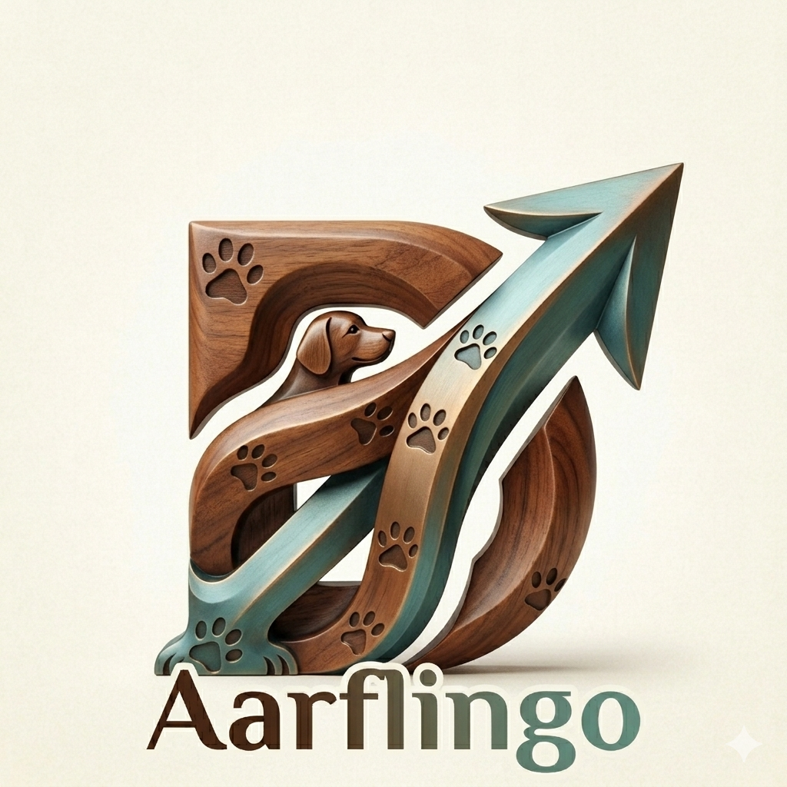

# Aarflingo



**Deepiri's Aarflingo** — proactive canine intent forecasting: webcam → perception → triad model → feedback → retrain → edge deploy.

## Quick start (webcam)

```bash
./setup.sh --run        # install system + project deps, train model, open Electron
./setup.sh            # install only
./setup.sh --kill     # stop runtime + Electron

# manual split:
./scripts/run_runtime.sh    # API on http://127.0.0.1:8765
cd apps/aarf-studio && npm run dev   # browser UI
```

See [docs/CONTRIBUTING.md](docs/CONTRIBUTING.md) and [docs/ELECTRON.md](docs/ELECTRON.md).

## Architecture

| Path | Role |
|------|------|
| `ethogram/` | Intent / emotion / behavior taxonomy + coupling matrix |
| `core/feature_spec.py` | 20-dim perception vector layout |
| `services/perception` | OpenCV motion dog detect, gaze zones, scene |
| `services/forecast` | PyTorch TriadNet (BiLSTM-style MLP), train + infer |
| `services/feedback` | SQLite prediction log + human corrections |
| `services/runtime` | FastAPI + WebSocket live webcam inference |
| `services/edge-runtime` | Jetson / collar loop (ONNX optional) |
| `services/artifact-bridge` | ONNX export for studio + hardware |
| `apps/aarf-studio` | Live camera UI + feedback buttons |
| `infra/docker/` | `runtime.Dockerfile` + `jetson.Dockerfile` |

## API (runtime)

- `GET /health` — status
- `POST /live/start` — OpenCV webcam on server (`{"camera":0}`)
- `POST /infer/frame` — JPEG upload → prediction (browser camera path)
- `POST /feedback` — rate / correct a prediction
- `POST /live/retrain` — export feedback → fine-tune checkpoint
- `WS /ws/live` — streaming predictions

## Hardware deploy

```bash
# x86/ARM runtime container (USB webcam)
docker compose -f infra/docker/docker-compose.yml up aarf-runtime

# Jetson (L4T base image — build on device or with buildx)
docker build -f infra/docker/jetson.Dockerfile -t aarflingo-edge .
# on collar / Jetson:
poetry run aarflingo-edge run --camera 0
```

Calibrate gaze zones for your home: edit `infra/configs/zones.default.yaml` (door / toy / bowl regions).

## Training & retrain

Multimodal pipeline: **YOLO vision** + **vocal encoder** + **ECG/IMU vitals** → **TriadNet** fusion.

```bash
./scripts/train_aarflingo.sh         # all stages (downloads YOLOv8n on first run)
SKIP_VISION=1 ./scripts/train_aarflingo.sh   # audio + physio + triad only
./scripts/verify_aarflingo.sh        # tests + train + runtime API + studio build
make train
make verify
```

Public dataset catalog: [docs/DATASETS.md](docs/DATASETS.md) (PhysioZoo, DogSpeak, Barkopedia, Mendeley IMU)

Math reference: [docs/MATH.md](docs/MATH.md) · notebooks: [notebooks/](notebooks/)

From human feedback export:

```bash
cd services/feedback && poetry run aarflingo-feedback export --out ../../artifacts/feedback/export.json
cd ../forecast && poetry run aarflingo-forecast train --feedback ../../artifacts/feedback/export.json
```

## License

Apache-2.0 — see [LICENSE](LICENSE).
