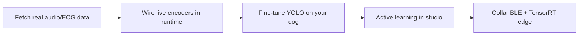

# Aarflingo Roadmap

Living plan for **deepiri-aarflingo**. Updated after multimodal training, WSL webcam bridge, and studio UI v2 (`f0392af`).

---

## Shipped (v0.1 — baseline)

| Area | What works |
|------|------------|
| **Studio** | Electron + Vite UI, live camera tab, intent hero, feedback buttons, modality bars |
| **Webcam** | Browser `getUserMedia`, WSL MJPEG bridge (lighthouse pattern), server OpenCV path |
| **Runtime** | FastAPI + WebSocket, `/infer/frame`, `/live/retrain`, `/bridge/info` |
| **Perception** | Motion dog detect, gaze zones, YOLOv8n dog bbox (optional), 28-dim feature vector |
| **Forecast** | TriadNet train/export ONNX, coupling-aware loss, synthetic + feedback retrain |
| **Multimodal train** | `train_aarflingo.sh` — vision + `services/audio` + `lib/aarf-physio` + triad fusion |
| **Feedback** | SQLite store, export JSON, one-click retrain from studio |
| **Edge** | `edge-runtime` CLI, Docker/Jetson Dockerfiles |
| **CI** | Lean 2-job Python + JS; CodeQL on `main` + weekly |

Docs: [WEBCAM.md](WEBCAM.md) · [DATASETS.md](DATASETS.md) · [DEPLOY.md](DEPLOY.md)

---

## Now → v0.2 (next 2–4 weeks)

Priority: **make live inference use real multimodal signals**, not only synthetic training shapes.

### 1. Real dataset fine-tuning

- [ ] Run `./scripts/fetch_public_datasets.sh --barkopedia` and wire Barkopedia clips into `services/audio` trainer (replace / augment synthetic barks)
- [ ] Optional PhysioNet PhysioZoo dog ECG download + `lib/aarf-physio` loader for real HRV labels
- [ ] Document minimum sample counts and expected val accuracy in [DATASETS.md](DATASETS.md)

**Done when:** `vocal.pt` / `vitals.pt` metrics improve on held-out real clips; manifest records dataset version.

### 2. Live runtime multimodal fusion

- [ ] Load `vocal.pt` in runtime when mic audio present (Web Audio → MFCC → encoder)
- [ ] Load `vitals.pt` when BLE/serial IMU or ECG puck connected (stub OK with simulated feed first)
- [ ] Merge encoder outputs into `core/modality_spec` features before TriadNet infer (today: synthetic dims at train time only)

**Done when:** studio modality bars move from live mic/IMU, not static zeros.

### 3. Vision quality

- [ ] Fine-tune YOLOv8 on home dog clips from `services/ingest` (label bbox in studio or export frames)
- [ ] Replace motion-only fallback when `dog_yolo.onnx` confidence &lt; threshold
- [ ] Optional: MediaPipe / YOLO-pose keypoints → gaze proxy upgrade ([LABELING.md](LABELING.md))

**Done when:** stable bbox on your dog at 5+ fps on WSL bridge stream.

### 4. Studio & active learning

- [ ] Surface low-confidence / `gate=review` frames in History tab with “label this” CTA
- [ ] In-app gaze zone editor (drag rects on live preview → write `zones.default.yaml`)
- [ ] Auto-reconnect WebSocket + bridge health indicator in header

**Done when:** one session produces ≥10 feedback rows and retrain improves val acc on next `make train`.

### 5. Dev ergonomics

- [ ] `setup.sh --run` optional flag to spawn Windows bridge hint / health check
- [ ] Single `make dev` that starts runtime + Vite + prints WSL bridge instructions
- [ ] Add runtime test for `/bridge/info` on WSL CI matrix (optional, `SKIP_VISION` pattern)

---

## v0.3 — collar & edge (Phase 2)

See [PHASE2_COLLAR.md](PHASE2_COLLAR.md).

- [ ] BLE puck contract: 1 Hz triad summary (CBOR) + clip upload on trigger
- [ ] `edge-runtime` consumes ONNX triad + vocal head on Jetson Orin Nano
- [ ] ONNX → TensorRT INT8 with calibration frames from your home
- [ ] IMU @ 100 Hz path aligned with Mendeley posture dataset labels

**Done when:** collar dev kit streams intent to studio without USB webcam.

---

## Later

| Theme | Notes |
|-------|--------|
| **Multi-dog** | Re-ID embedding + per-dog checkpoint or household graph |
| **Federated ethogram** | Breed-specific coupling tweaks; export signed manifest bundles |
| **On-device policy** | `lib/aarf-gate` + TTS speak intent; no aversive actuation ([ETHICS.md](ETHICS.md)) |
| **iOS pocket** | CoreML bundle via `artifact-bridge`; Swift gate client |
| **Active learning loop** | Labeler service queue ← runtime low-confidence harvest |

---

## Suggested work order



1. **Fetch + train on real bark/ECG samples** — fastest signal that multimodal path is real  
2. **Runtime encoder wiring** — studio bars and predictions reflect mic/IMU  
3. **YOLO fine-tune** — perception accuracy for your room/lighting  
4. **Active learning UI** — close the feedback → retrain loop with your dog  
5. **Collar / Jetson** — hardware path in [DEPLOY.md](DEPLOY.md)

---

## How to validate each milestone

```bash
make verify                    # full stack: tests + train + runtime + studio build
./scripts/train_aarflingo.sh     # produce all model artifacts
./setup.sh --run               # studio + runtime (WSL: start bridge on Windows first)
curl http://127.0.0.1:8765/bridge/info
```

---

## Links

- Architecture: [ARCHITECTURE.md](ARCHITECTURE.md)
- Training math: [MATH.md](MATH.md)
- Contributing / CI: [CONTRIBUTING.md](CONTRIBUTING.md)
