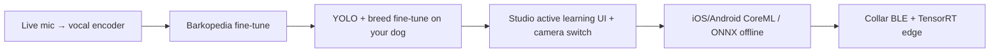

# Aarflingo Roadmap

Living plan for **deepiri-aarflingo**. Updated after v0.3 vision work — dog detection
on still frames (YOLO weights shipped) + 120-breed classification + live camera switching.

---

## Shipped (v0.3 — real dog detection, breed ID, camera switching)

| Area | What shipped |
|------|-------------|
| **YOLO detection live** | `yolov8n.pt` weights now ship/download via `prepare-vision`; pipeline uses YOLO (COCO class 16) when weights exist instead of silently falling back to motion-only — a still dog now gets a bounding box |
| **Breed classifier** | `services/perception/app/breed.py` — MobileNetV3-Large fine-tuned on Stanford Dogs (120 breeds, 20,580 images) → `artifacts/models/vision/breed.pt` + `breed_labels.json`; 74.6% held-out top-1 accuracy |
| **Hybrid breed ensemble** | Max-rule between fine-tuned 120-way head and ImageNet dog-only head — fine-tuned wins on dataset photos, ImageNet wins on natural/out-of-distribution photos (e.g. a real yellow-lab photo → "Labrador retriever") |
| **Breed annotation** | Pipeline emits `breed`, `breed_conf`, `breed_top3` features per frame; flows through runtime `process_frame` → WebSocket payload → studio overlay can draw breed on the box |
| **Breed training CLI** | `aarflingo-perception train-breed` + `breed` stage in `train_aarflingo.sh` (`BREED_EPOCHS`) + manifest artifacts |
| **Camera input switch** | `/cameras` (enumerate OpenCV devices), `/live/camera` (live-switch source without restart), `/live/start` accepts `mode=server` to read local camera directly; runtime tracks loop task + reports `camera_error` |
| **Studio contract** | `platform.ts`: `CameraDevice`, `CamerasInfo`, `fetchCameras()`, `switchLiveCamera()`, `stopLive()`, `LiveStatus.camera_error` |

---

## Shipped (v0.1 — baseline)

| Area | What works |
|------|------------|
| **Studio** | Electron + Vite UI, live camera tab, intent hero, feedback buttons, modality bars |
| **Webcam** | Browser `getUserMedia`, WSL MJPEG bridge (lighthouse pattern), server OpenCV path |
| **Runtime** | FastAPI + WebSocket, `/infer/frame`, `/live/retrain`, `/bridge/info` |
| **Perception** | Motion dog detect, gaze zones, YOLOv8n dog bbox (optional), 28-dim feature vector |
| **Forecast** | TriadNet train/export ONNX, coupling-aware loss, synthetic + feedback retrain |
| **Multimodal train** | `train_aarflingo.sh` — vision + `services/audio` + `lib/aarf-physio` + triad fusion |
| **Feedback** | SQLite store, export JSON, one-click retrain from studio |
| **Edge** | `edge-runtime` CLI, Docker/Jetson Dockerfiles |
| **CI** | Lean 2-job Python + JS; CodeQL on `main` + weekly |
| **Mobile** | SwiftUI + Compose pocket apps (UI shell), WSL Android emulator scripts, mobile CI |

---

## Shipped (v0.2 — voice + real data + mobile camera)

| Area | What shipped | PR |
|------|-------------|-----|
| **Vision real-data** | `RealDogImageStore` — Stanford Dogs → perception pipeline → JSONL feature rows | #18 |
| **Perception CLI** | `collect-real` + `verify-real` commands | #18 |
| **Dataset fetch** | `fetch_public_datasets.sh --dog-images` + `--dog-images-sample` | #18 |
| **Speech client** | `deepiri-speech` HTTP client (TTS + STT) + offline silent-WAV fallback | #18 |
| **Dog voice** | Phrase bank keyed by `(intent, emotion)`, bark→spoken response, DogVoice cooldown | #18 |
| **Voice CLI** | `aarflingo-voice speak / listen / respond / status / play` | #18 |
| **Mic listener** | Background thread: 300 ms chunks, bark energy detection, arousal/valence classify | #18 |
| **Conversation engine** | `ConversationEngine`: speak → listen → EMA phrase weight update → persist weights | #18 |
| **Voice outcomes DB** | `voice_outcomes` table, `log_voice_outcome`, `/voice/outcomes` + `/voice/weights` API | #18 |
| **Runtime voice hook** | `VOICE_ENABLED=1` → `_conversation_speak(pred)` in `process_frame`; mic drain thread | #18 |
| **setup.sh web mode** | `--web` flag: vite preview on `0.0.0.0`, LAN URL banner, headless auto-detect | #18 |
| **Studio mobile detect** | `isMobileBrowser()` auto-selects browser-cam, hides WSL/server tabs on phone | #18 |
| **iOS real camera** | `CameraManager` (AVCaptureSession, 5fps JPEG), `RuntimeClient` (WebSocket + HTTP), live `LiveView` | #18 |
| **Android real camera** | CameraX RGBA→JPEG, `RuntimeClient.kt` (OkHttp WS + multipart), `AppViewModel` wired | #18 |
| **Tests** | 48 Python tests (48 pass): core 11, perception 6, voice 26, audio 1, forecast 2, feedback 1, ingest 1 | #18 |
| **Docs** | `docs/VOICE.md` — conversation loop, phrase weights, mic setup | #18 |

Docs: [VOICE.md](VOICE.md) · [WEBCAM.md](WEBCAM.md) · [DATASETS.md](DATASETS.md) · [DEPLOY.md](DEPLOY.md)

---

## Now → v0.4 (next 2–4 weeks)

Priority: **close the remaining gaps so every signal is live, not synthetic.**

### 1. Live multimodal encoder wiring

The studio modality bars (Audio arousal, ECG stress, IMU activity) show static zeros at
inference time. The encoders exist and are trained — they just aren't loaded in the
runtime's `process_frame` path.

- [ ] Load `vocal.pt` in runtime; feed mic audio chunks from `MicListener` → MFCC → encoder → feature dims
- [ ] Load `vitals.pt` when BLE/serial IMU connected (stub with simulated 6-DoF first)
- [ ] Merge encoder outputs into `core/modality_spec` features before TriadNet call
- [ ] Studio modality bars animate from live mic and IMU signals

**Done when:** studio shows non-zero Audio + IMU bars while dog is in frame.

### 2. Real Barkopedia fine-tune

- [ ] `./scripts/fetch_public_datasets.sh --barkopedia` → wire into `services/audio/app/train.py`
- [ ] Replace / augment synthetic bark generation with real Barkopedia clips
- [ ] Held-out val accuracy logged to manifest (`artifacts/manifests/`)
- [ ] Optional: PhysioZoo dog ECG → `lib/aarf-physio` loader for real HRV labels

**Done when:** `vocal.pt` arousal/valence accuracy improves on real held-out clips.

### 3. Vision → dog-communication (YOLO + breed live in your home)

**Shipped:** YOLO weights download + use on still frames; 120-breed classifier (74.6% held-out);
hybrid ImageNet ensemble for natural photos; breed annotations flow through the runtime.

- [ ] Label home clips from `services/ingest` (export frames → bbox annotation in studio or Roboflow)
- [ ] Fine-tune YOLOv8n on labelled frames; export updated `dog_yolo.onnx`
- [ ] **Breed fine-tune on your dog**: capture his stills from the live box → add to a personal breed/trait set; retrain with `aarflingo-perception train-breed`
- [ ] Studio camera-view overlay draws the breed label + confidence on the bbox
- [ ] Dog profile auto-fill: detected breed pre-fills `DogProfile.breed` on first match
- [ ] Optional: YOLO-pose keypoints → gaze proxy upgrade

**Done when:** stable `dog_present=true` and bbox at 5+ fps in your room/lighting, with
the breed label drawn on the box.

### 4. Studio active learning UI

- [ ] Surface low-confidence / `gate=review` frames in History tab with "label this" CTA
- [ ] In-app gaze zone editor (drag rects on live preview → write `zones.default.yaml`)
- [ ] Auto-reconnect WebSocket + bridge health indicator in header
- [ ] Voice outcomes panel: show recent phrase → bark response pairs and learned weights
- [ ] Camera input switch UI: device dropdown fed by `/cameras`, live-switch via `/live/camera`

**Done when:** one live session produces ≥10 feedback rows and the conversation engine
shows measurable weight drift from baseline.

### 5. iOS / Android polish

- [ ] iOS: CoreML bundle export via `artifact-bridge` → on-device TriadNet inference (no server needed)
- [ ] Android: same via ONNX Runtime Android
- [ ] Both apps: display voice phrase spoken + bark response in Live tab
- [ ] Settings: configure runtime URL + voice enable toggle

**Done when:** iOS app runs basic intent prediction offline; Android runs at 5fps on-device.

### 6. Dev ergonomics

- [ ] `make dev` starts runtime + Vite + prints LAN URL (replaces `./setup.sh --run --web`)
- [ ] `setup.sh` prints WSL bridge hint when DISPLAY is missing
- [ ] CI: add `/voice/outcomes` endpoint smoke test
- [ ] CI: add Android build to `mobile.yml`

---

## v0.4 — collar & edge (Phase 2)

See [PHASE2_COLLAR.md](PHASE2_COLLAR.md).

- [ ] BLE puck contract: 1 Hz triad summary (CBOR) + clip upload on trigger
- [ ] `edge-runtime` consumes ONNX triad + vocal head on Jetson Orin Nano
- [ ] ONNX → TensorRT INT8 with calibration frames from your home
- [ ] IMU @ 100 Hz aligned with Mendeley posture dataset labels
- [ ] Collar sends bark events → runtime `on_bark` path (no laptop mic needed)

**Done when:** collar dev kit streams intent to studio without USB webcam.

---

## Later

| Theme | Notes |
|-------|--------|
| **Multi-dog** | Re-ID embedding + per-dog checkpoint or household graph |
| **Federated ethogram** | Breed-specific coupling tweaks; export signed manifest bundles |
| **Phrase personalisation v2** | Full contextual bandit (LinUCB) replacing EMA weights |
| **Active learning loop** | Labeler service queue ← runtime low-confidence harvest |
| **Longitudinal dashboard** | Week-over-week intent distribution + conversation history |
| **Privacy** | Local-only mode: all inference + voice on-device, no cloud calls |

---

## Work order for v0.4


```mermaid
flowchart LR
  A[Live mic → vocal encoder] --> B[Barkopedia fine-tune]
  B --> C[YOLO + breed fine-tune on your dog]
  C --> D[Studio active learning UI + camera switch]
  D --> E[iOS/Android CoreML / ONNX offline]
  E --> F[Collar BLE + TensorRT edge]
```

1. **Wire live vocal encoder** — mic is already captured; feeding it into `process_frame` is one file change
2. **Barkopedia fine-tune** — real bark data → better arousal/valence → better conversation responses
3. **YOLO + breed fine-tune** — your dog, your room, stable bbox + breed label on the box
4. **Active learning UI + camera switch** — close the feedback → retrain loop visually; device dropdown via `/cameras`
5. **On-device CoreML / ONNX** — cut the WiFi dependency for iOS/Android
6. **Collar** — full hardware path

---

## How to run everything today

```bash
# Install + train + launch (desktop Electron)
./setup.sh --run

# Install + train + serve on LAN (phone browser, no Electron needed)
./setup.sh --run --web

# With voice loop (deepiri-speech engine required, or offline fallback)
VOICE_ENABLED=1 SPEECH_URL=http://localhost:5020 ./setup.sh --run --web

# iOS: open apps/aarf-pocket-ios in Xcode → run on device
# Android: cd apps/aarf-pocket-android && ./gradlew installDebug
# Both: set Runtime URL in Settings to http://<your-laptop-LAN-ip>:8765

# Full test matrix
make test

# Train all models
make train

# Train just the vision stack (YOLO weights + 120-breed classifier)
./scripts/fetch_public_datasets.sh --dog-images
STAGES=vision,breed ./scripts/train_aarflingo.sh

# Verify everything
make verify
```

---

## Links

- Voice loop: [VOICE.md](VOICE.md)
- Datasets: [DATASETS.md](DATASETS.md)
- Architecture: [ARCHITECTURE.md](ARCHITECTURE.md)
- Training math: [MATH.md](MATH.md)
- Webcam / WSL: [WEBCAM.md](WEBCAM.md)
- Contributing / CI: [CONTRIBUTING.md](CONTRIBUTING.md)
- Deploy / edge: [DEPLOY.md](DEPLOY.md)
