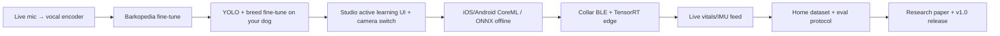

# Aarflingo Roadmap

Living plan for **deepiri-aarflingo** — shipped through the full on-device + math-wiring
milestone (PR #23), tracked to completion (v1.0) and the research paper.

> **Status snapshot (this update):** PR #23 merged — on-device inference for both pocket apps,
> all nine ADVANCED_MATH modules wired into the runtime/forecast/mobile path, gaze zone editor,
> studio health header with WS latency, dog YOLO tooling. Branch `feat/full-roadmap` extends the
> plan through home-data fine-tuning, live vitals fusion, collar/edge hardware, and publication.

---

## Shipped (v0.3 — real dog detection, breed ID, camera switching)

| Area | What shipped |
|------|-------------|
| **YOLO detection live** | `yolov8n.pt` weights now ship/download via `prepare-vision`; pipeline uses YOLO (COCO class 16) when weights exist instead of silently falling back to motion-only — a still dog now gets a bounding box |
| **Breed classifier** | `services/perception/app/breed.py` — MobileNetV3-Large fine-tuned on Stanford Dogs (120 breeds, 20,580 images) → `artifacts/models/vision/breed.pt` + `breed_labels.json`; 74.6% held-out top-1 accuracy |
| **Hybrid breed ensemble** | Max-rule between fine-tuned 120-way head and ImageNet dog-only head — fine-tuned wins on dataset photos, ImageNet wins on natural/out-of-distribution photos (e.g. a real yellow-lab photo → "Labrador retriever") |
| **Breed annotation** | Pipeline emits `breed`, `breed_conf`, `breed_top3` features per frame; flows through runtime `process_frame` → WebSocket payload → studio overlay can draw breed on the box |
| **Breed training CLI** | `aarflingo-perception train-breed` + `breed` stage in `train_aarflingo.sh` (`BREED_EPOCHS`) + manifest artifacts |
| **Camera input switch** | `/cameras` (enumerate OpenCV devices), `/live/camera` (live-switch source without restart), `/live/start` accepts `mode=server` to read local camera directly; runtime tracks loop task + reports `camera_error` |
| **Studio contract** | `platform.ts`: `CameraDevice`, `CamerasInfo`, `fetchCameras()`, `switchLiveCamera()`, `stopLive()`, `LiveStatus.camera_error` |

---

## Shipped (v0.1 — baseline)

| Area | What works |
|------|------------|
| **Studio** | Electron + Vite UI, live camera tab, intent hero, feedback buttons, modality bars |
| **Webcam** | Browser `getUserMedia`, WSL MJPEG bridge (lighthouse pattern), server OpenCV path |
| **Runtime** | FastAPI + WebSocket, `/infer/frame`, `/live/retrain`, `/bridge/info` |
| **Perception** | Motion dog detect, gaze zones, YOLOv8n dog bbox (optional), 28-dim feature vector |
| **Forecast** | TriadNet train/export ONNX, coupling-aware loss, synthetic + feedback retrain |
| **Multimodal train** | `train_aarflingo.sh` — vision + `services/audio` + `lib/aarf-physio` + triad fusion |
| **Feedback** | SQLite store, export JSON, one-click retrain from studio |
| **Edge** | `edge-runtime` CLI, Docker/Jetson Dockerfiles |
| **CI** | Lean 2-job Python + JS; CodeQL on `main` + weekly |
| **Mobile** | SwiftUI + Compose pocket apps (UI shell), WSL Android emulator scripts, mobile CI |

---

## Shipped (v0.2 — voice + real data + mobile camera)

| Area | What shipped | PR |
|------|-------------|-----|
| **Vision real-data** | `RealDogImageStore` — Stanford Dogs → perception pipeline → JSONL feature rows | #18 |
| **Perception CLI** | `collect-real` + `verify-real` commands | #18 |
| **Dataset fetch** | `fetch_public_datasets.sh --dog-images` + `--dog-images-sample` | #18 |
| **Speech client** | `deepiri-speech` HTTP client (TTS + STT) + offline silent-WAV fallback | #18 |
| **Dog voice** | Phrase bank keyed by `(intent, emotion)`, bark→spoken response, DogVoice cooldown | #18 |
| **Voice CLI** | `aarflingo-voice speak / listen / respond / status / play` | #18 |
| **Mic listener** | Background thread: 300 ms chunks, bark energy detection, arousal/valence classify | #18 |
| **Conversation engine** | `ConversationEngine`: speak → listen → EMA phrase weight update → persist weights | #18 |
| **Voice outcomes DB** | `voice_outcomes` table, `log_voice_outcome`, `/voice/outcomes` + `/voice/weights` API | #18 |
| **Runtime voice hook** | `VOICE_ENABLED=1` → `_conversation_speak(pred)` in `process_frame`; mic drain thread | #18 |
| **Non-blocking TTS** | Speak+save dispatched to background worker (never stalls 15 fps loop); `voice` event broadcast to studio | #18 |
| **setup.sh web mode** | `--web` flag: vite preview on `0.0.0.0`, LAN URL banner, headless auto-detect | #18 |
| **Studio mobile detect** | `isMobileBrowser()` auto-selects browser-cam, hides WSL/server tabs on phone | #18 |
| **iOS real camera** | `CameraManager` (AVCaptureSession, 5fps JPEG), `RuntimeClient` (WebSocket + HTTP), live `LiveView` | #18 |
| **Android real camera** | CameraX RGBA→JPEG, `RuntimeClient.kt` (OkHttp WS + multipart), `AppViewModel` wired | #18 |
| **Tests** | 48 Python tests (48 pass): core 11, perception 6, voice 26, audio 1, forecast 2, feedback 1, ingest 1 | #18 |
| **Docs** | `docs/VOICE.md` — conversation loop, phrase weights, mic setup | #18 |

Docs: [VOICE.md](VOICE.md) · [WEBCAM.md](WEBCAM.md) · [DATASETS.md](DATASETS.md) · [DEPLOY.md](DEPLOY.md)

---

## Shipped (PR #23 — on-device inference + full ADVANCED_MATH wiring)

Merged `01ae996`. Every one of the nine math modules in [`ADVANCED_MATH.md`](ADVANCED_MATH.md)
is now wired into the model/pipeline, not just documented.

| Area | What shipped |
|------|-------------|
| **§7 synchrony live** | `services/runtime/app/synchrony_state.py` — cross-modal phase-locking (`phase_locking_value`), motion↔bark `cross_correlation`, `LatentStateKalman` arousal/valence fusion; `process_frame` calls `update_sync` each frame |
| **§9 temporal backbone** | `train_temporal_epochs` (MoCo-style contrastive pre-train + CE + arousal/valence regression heads), `export_onnx_temporal` (5-output ONNX), `predict_from_temporal`, `build_temporal` CLI, `--temporal` export flag |
| **Dataset at 73 dims** | All §4/§7/§8 features per intent; flat `triad.pt` retrained at 73 dims; `triad_temporal.pt` trained; studio `triad.onnx` re-exported `[1, 1095]` |
| **Mobile offline inference** | iOS CoreML + Android ONNX Runtime — `FEATURE_DIM`/`featureDim` 43→73, dim-synced feature names in studio `labels.ts` |
| **Mobile reliability** | iOS `ObservableObject` conformance, off-main Android model init, thread-safe iOS frame diff, ORT `Optional`/`dogPresent` compile fixes |
| **Studio live tools** | WS latency in header, cover-crop-correct zone editor, `label-this` in History, camera device switch |
| **Runtime polish** | Hot-reload gaze zones + malformed-config fallback; forecast cache of incompatible checkpoints |

**Verification:** all CI green at merge — JS, Python (core+services), android, ios, Analyze.
Studio build clean; all service test suites pass (core 17, runtime 17, perception 25, forecast 2,
feedback 2, voice 28, audio 8).

---

## Now → v0.4 (next 2–4 weeks)

Priority: **close the remaining gaps so every signal is live, not synthetic.**

### 1. Live multimodal encoder wiring

The studio modality bars (Audio arousal, ECG stress, IMU activity) show static zeros at
inference time. The encoders exist and are trained — they just aren't loaded in the
runtime's `process_frame` path.

- [x] Load `vocal.pt` in runtime; feed mic audio chunks from `MicListener` → MFCC → encoder → feature dims (heuristic fallback when no checkpoint; continuous `audio_arousal`/`audio_valence`/`audio_bark_prob` fused into `process_frame` via `STATE.latest_audio_modality`)
- [ ] Load `vitals.pt` when BLE/serial IMU connected (stub with simulated 6-DoF first) — encoder + PhysioZoo/Mendeley-shaped train pipeline exist in `lib/aarf-physio`; the runtime has no vitals feed yet
- [x] Merge encoder outputs into `core/modality_spec` features before TriadNet call — full 73-dim feature spec now wired end-to-end (see PR #23 shipped section)
- [x] Studio modality bars animate from live mic — voice/Audio bars move with the mic; IMU/ECG bars remain static until the vitals feed lands

**Done when:** studio shows non-zero Audio + IMU bars while dog is in frame.

### 2. Real Barkopedia fine-tune

- [x] `./scripts/fetch_public_datasets.sh --barkopedia` → wire into `services/audio/app/train.py` (loader + CLI `--data` + `train_aarflingo.sh` audio stage)
- [x] Replace / augment synthetic bark generation with real Barkopedia clips (all 298 real clips now used; checkpoint selected by **real** held-out acc when present)
- [x] Held-out val accuracy logged to manifest (`artifacts/manifests/`) — `vocal_metrics.json` now carries `best_val_acc_by_source` split (`real` vs `synth`)
- [ ] Optional: PhysioZoo dog ECG → `lib/aarf-physio` loader for real HRV labels

**Done when:** `vocal.pt` arousal/valence accuracy improves on real held-out clips. ✔️ real held-out 0.107 → **0.345** (3.1× chance, chance 0.111); training script defaults bumped (AUDIO_EPOCHS 20→50, all real clips used).

### 3. Vision → dog-communication (YOLO + breed live in your home)

**Shipped:** YOLO weights download + use on still frames; 120-breed classifier (74.6% held-out);
hybrid ImageNet ensemble for natural photos; breed annotations flow through the runtime.

- [ ] Label home clips from `services/ingest` (export frames → bbox annotation in studio or Roboflow)
- [ ] Fine-tune YOLOv8n on labelled frames; export updated `dog_yolo.onnx`
- [ ] **Breed fine-tune on your dog**: capture his stills from the live box → add to a personal breed/trait set; retrain with `aarflingo-perception train-breed`
- [x] Studio camera-view overlay draws the breed label + confidence on the bbox (overlay chip above the box; `bbox`/`breed` fields now in WS payload)
- [x] Dog profile auto-fill: detected breed pre-fills `DogProfile.breed` on first match (conf ≥ 0.5, never overwrites a user-set breed)
- [ ] Optional: YOLO-pose keypoints → gaze proxy upgrade

**Done when:** stable `dog_present=true` and bbox at 5+ fps in your room/lighting, with
the breed label drawn on the box. (Overlay + autofill shipped; the remaining gap is
capturing your dog's frames for the fine-tune.)

### 4. Studio active learning UI

- [x] Surface low-confidence / `gate=review` frames in History tab with "label this" CTA (highlight <80% unlabelled rows; intent+emotion picker posts to `/feedback`)
- [x] In-app gaze zone editor (drag rects on live preview → write `zones.default.yaml`, hot-reloaded via `/gaze/zones`)
- [x] Auto-reconnect WebSocket + bridge health indicator in header (HealthHeader: runtime + bridge + WS latency)
- [x] Voice outcomes panel: show recent phrase → bark response pairs and learned weights (VoiceView tab ✅)
- [x] Camera input switch UI: device dropdown fed by `/cameras`, live-switch via `/live/camera` (dropdown in camera toolbar when >1 device)

**Done when:** one live session produces ≥10 feedback rows and the conversation engine
shows measurable weight drift from baseline.

### 5. iOS / Android polish

- [x] iOS: CoreML bundle export via `artifact-bridge` → on-device TriadNet inference (no server needed)
- [x] Android: same via ONNX Runtime Android
- [ ] Both apps: display voice phrase spoken + bark response in Live tab
- [x] Settings: configure runtime URL — both apps ship a Settings view (Android `SettingsScreen.kt`, iOS `SettingsView.swift`); voice-enable toggle still TBD

**Done when:** iOS app runs basic intent prediction offline; Android runs at 5fps on-device.

### 6. Dev ergonomics

- [x] `make dev` starts runtime + Vite + prints LAN URL (replaces `./setup.sh --run --web`) — `scripts/dev.sh`
- [x] `setup.sh` auto-detects headless/WSL (no DISPLAY) and switches to `--web` mode with a hint
- [ ] CI: add `/voice/outcomes` endpoint smoke test
- [x] CI: Android build added to `mobile.yml` (assembleDebug + APK artifact; iOS job on macOS runner)

---

## v0.4 — collar & edge (Phase 2)

See [PHASE2_COLLAR.md](PHASE2_COLLAR.md).

- [ ] BLE puck contract: 1 Hz triad summary (CBOR) + clip upload on trigger
- [ ] `edge-runtime` consumes ONNX triad + vocal head on Jetson Orin Nano
- [ ] ONNX → TensorRT INT8 with calibration frames from your home
- [ ] IMU @ 100 Hz aligned with Mendeley posture dataset labels
- [ ] Collar sends bark events → runtime `on_bark` path (no laptop mic needed)

**Done when:** collar dev kit streams intent to studio without USB webcam.

---

## Completion (v0.4 → v1.0) — closing the last live-signal + home-data gaps

The math is wired and every model trains; what remains is **real signals at inference time**
and **your dog's home data** replacing the last synthetic/lab shapes.

### 1. Live vitals / IMU feed (unblocks ECG + IMU bars)

- [ ] `vitals.pt` load path in runtime; `update_vitals_modality(features)` mirroring `update_audio_modality`; simulated 6-DoF IMU feed stub first, real BLE/serial next
- [ ] `modality_from_vitals` (ECG HRV + IMU activity → stress/activity) fused into `process_frame` before TriadNet
- [ ] Studio ECG stress + IMU activity bars animate from live vitals
- [ ] PhysioZoo dog ECG download (`fetch_public_datasets.sh --physiozoo`) → real HRV labels for `lib/aarf-physio` train; manifest records dataset version + held-out acc

**Done when:** studio shows live Audio + ECG + IMU bars while the dog is in frame, and `vitals.pt` val acc improves on real held-out HRV clips.

### 2. Home-data fine-tuning (vision + breed on your dog)

- [ ] Capture clips from your dog in your room via the live box (`services/ingest` export frames) → label bboxes (studio editor or Roboflow)
- [ ] Fine-tune YOLOv8n on labelled frames; export updated `dog_yolo.onnx`; re-verify 5+ fps on WSL bridge
- [ ] Add your dog's stills to a personal breed/trait set; `aarflingo-perception train-breed` retrain; confirm breed label + conf on the box
- [ ] Optional: YOLO-pose keypoints → gaze proxy upgrade

**Done when:** stable `dog_present=true` bbox + correct breed label at 5+ fps in your actual room/lighting; `/feedback` harvest ≥10 rows per live session.

### 3. Mobile voice + settings polish

- [ ] Both apps: show spoken phrase + bark response in Live tab (`/voice/outcomes` read)
- [ ] Voice-enable toggle + runtime URL in Settings (URL already shipped on both platforms)
- [ ] Offline mode: fall back to on-device TriadNet when runtime unreachable (auto-detect)

**Done when:** pocket app shows the conversation loop (phrase → response) and runs predictions offline.

### 4. Hardening / release gate

- [ ] CI: `/voice/outcomes` + `/live/status` smoke tests
- [ ] `make verify` includes mobile build + ONNX shape assertions (73-dim input)
- [ ] Ethics pass: document consent/IRB posture for home clips in [ETHICS.md](ETHICS.md); bias flags for breed under-representation
- [ ] Manifest integrity: checksums + dataset versions on all model artifacts (`aarflingo-verify-artifacts`)

**Done when:** `make verify` green end-to-end with real home clips in the dataset and a documented ethics/data sheet.

---

## Research paper (v1.0 target) — "AARFLingo: multimodal canine intent forecasting"

Goal: a reproducible, ethically-scoped methods paper with an open (or gated) dataset + checkpoints.

### 1. Contribution framing (what we publish)

- **Multimodal triad forecasting** — joint intent × emotion × behavior prediction from vision + audio + physiology, on edge hardware
- **§7 cross-modal synchrony features** — phase-locking between tail-wag motion and vocal arousal; a novel, cheap, explainable fusion signal
- **§9 temporal backbone** — BiLSTM + attention + MoCo contrastive pre-train + continuous arousal/valence heads; strong when audio/IMU streams are available
- **Active-learning loop** — live feedback → retrain → metric drift as a deployment story (not just a static benchmark)

### 2. Dataset & evaluation protocol (the credible part)

- [ ] **Home dataset** — N≥3 dogs (start with yours), ~hours of annotated sessions via studio feedback + labeler service; IRB/consent posture documented
- [ ] **Public augmentation** — Stanford Dogs (vision), Barkopedia (audio), PhysioZoo (ECG/HRV), Mendeley (IMU) as pre-train corpora; splits by **dog** (never random-frame) to test generalization
- [ ] **Metrics** — per-intent macro-F1, confusion-corrected accuracy (coupling matrix), arousal/valence RMSE + rank correlation, calibration (ECE), latency/FPS on Jetson + phone
- [ ] **Baselines** — chance/majority, flat MLP TriadNet, per-modality single encoders, RGB-only, audio-only, vitals-only; ablation of §7 synchrony + §9 temporal components
- [ ] **Reproducibility** — pinned seeds, manifest checksums, Docker/Jetson builds, CLI-reproducible `make train && make verify` on a fresh clone

**Done when:** a `docs/paper/` dir with `METHODS.md`, `RESULTS.md`, `DATASHEET.md`, and a `reproduce.md` that a reviewer can run; all tables generated by scripts, not hand-edited.

### 3. Writing & release timeline

- [ ] **v1.0-M3:** dataset + eval harness frozen; baseline/ablation table generated
- [ ] **v1.0-M4:** full methods + results draft; figures from notebook exports
- [ ] **v1.0-M5:** internal review (ethogram experts + ML reviewer), ethics/data-sheet polish
- [ ] **v1.0-M6:** release artifacts (model checkpoints, ONNX, code tag `v1.0`) + submit to a venue (e.g. ACII/ICMI animal-AI track, or NeurIPS Datasets & Benchmarks for the dataset paper, or a vet-behavioural journal)

**Done when:** paper submitted with DOI + artifacts tagged, and the repo has a `v1.0` release.

---

## Later

| Theme | Notes |
|-------|--------|
| **Multi-dog** | Re-ID embedding + per-dog checkpoint or household graph |
| **Federated ethogram** | Breed-specific coupling tweaks; export signed manifest bundles |
| **Phrase personalisation v2** | Full contextual bandit (LinUCB) replacing EMA weights |
| **Active learning loop** | Labeler service queue ← runtime low-confidence harvest |
| **Longitudinal dashboard** | Week-over-week intent distribution + conversation history |
| **Privacy** | ✅ Local-first by default: vision + voice run on-device (Kokoro TTS, faster-whisper STT); no cloud calls unless OpenAI explicitly opted in |

---

## Work order


```mermaid
flowchart LR
  A[Live mic → vocal encoder] --> B[Barkopedia fine-tune]
  B --> C[YOLO + breed fine-tune on your dog]
  C --> D[Studio active learning UI + camera switch]
  D --> E[iOS/Android CoreML / ONNX offline]
  E --> F[Collar BLE + TensorRT edge]
  F --> G[Live vitals/IMU feed]
  G --> H[Home dataset + eval protocol]
  H --> I[Research paper + v1.0 release]
```

1. **Wire live vocal encoder** — ✅ DONE: `MicListener` emits continuous audio modality (arousal/valence/bark_prob) every chunk → `update_audio_modality` → fused into `process_frame` features (heuristic fallback when `vocal.pt` absent)
2. **Barkopedia fine-tune** — ✅ DONE: all 298 real clips train the encoder; real held-out 0.345 (3.1× chance); checkpoint selection + metrics now real-driven
3. **YOLO + breed fine-tune** — your dog, your room, stable bbox + breed label on the box (home capture pending — Completion §2)
4. **Active learning UI + camera switch** — ✅ DONE: "label this" CTA in History, camera device dropdown via `/cameras` + `/live/camera`, gaze zone editor, header WS/bridge health
5. **On-device CoreML / ONNX** — ✅ DONE: both pocket apps run TriadNet offline at 73-dim (PR #23)
6. **Collar** — full hardware path (Phase 2 above)
7. **Live vitals/IMU feed** — load `vitals.pt` in runtime + simulated/real feed (Completion §1)
8. **Home dataset + eval protocol** — N≥3 dogs, per-dog splits, baseline/ablation tables (Paper §2)
9. **Research paper + v1.0 release** — methods/results/data-sheet, tagged artifacts, submission (Paper §3)

---

## How to run everything today

```bash
# Install + train + launch (desktop Electron)
./setup.sh --run

# Install + train + serve on LAN (phone browser, no Electron needed)
./setup.sh --run --web

# With voice loop (deepiri-speech engine required, or offline fallback)
VOICE_ENABLED=1 SPEECH_URL=http://localhost:5020 ./setup.sh --run --web

# iOS: open apps/aarf-pocket-ios in Xcode → run on device
# Android: cd apps/aarf-pocket-android && ./gradlew installDebug
# Both: set Runtime URL in Settings to http://<your-laptop-LAN-ip>:8765

# Full test matrix
make test

# Train all models
make train

# Train just the vision stack (YOLO weights + 120-breed classifier)
./scripts/fetch_public_datasets.sh --dog-images
STAGES=vision,breed ./scripts/train_aarflingo.sh

# Verify everything
make verify
```

---

## Links

- Voice loop: [VOICE.md](VOICE.md)
- Datasets: [DATASETS.md](DATASETS.md)
- Architecture: [ARCHITECTURE.md](ARCHITECTURE.md)
- Training math: [MATH.md](MATH.md)
- Advanced emotion math: [ADVANCED_MATH.md](ADVANCED_MATH.md)
- Webcam / WSL: [WEBCAM.md](WEBCAM.md)
- Contributing / CI: [CONTRIBUTING.md](CONTRIBUTING.md)
- Deploy / edge: [DEPLOY.md](DEPLOY.md)
- Ethics / data sheet: [ETHICS.md](ETHICS.md)
- Collar / Phase 2: [PHASE2_COLLAR.md](PHASE2_COLLAR.md)
